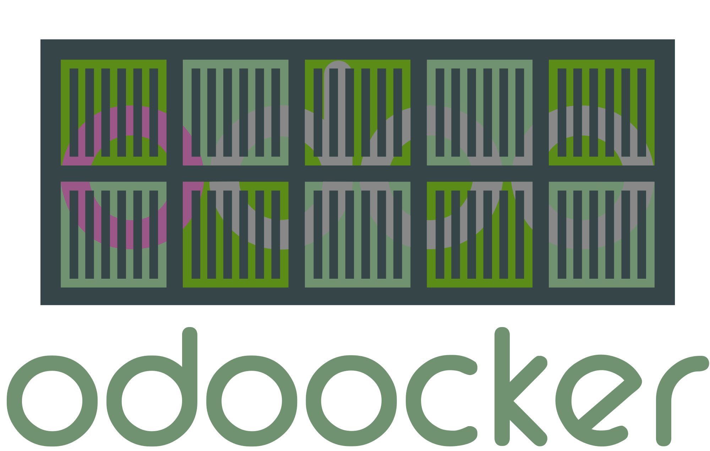

# Gerador Odooker

**Gerador de configurações Docker para Odoo Community Edition**

Um wizard web interativo que gera configurações completas e prontas para produção do Odoo usando Docker Compose. Simplifica a criação de ambientes Odoo com PostgreSQL, Redis, Nginx e configurações de segurança.

## 🚀 Online

**[👉 Acesse o Gerador Odooker](https://dikluwe.github.io/odooker/)**

## ✨ Funcionalidades

- **🎯 Wizard Intuitivo**: Interface guiada em 4 passos simples
- **🔐 Senhas Seguras**: Geração automática de senhas criptograficamente seguras
- **📦 Download ZIP**: Baixe todos os arquivos organizados em estrutura de pastas
- **🚀 Pronto para Produção**: Configurações otimizadas para diferentes ambientes
- **📋 Preview de Comandos**: Veja exatamente quais comandos executar
- **🔧 Configuração Flexível**: PostgreSQL, Redis, Nginx opcionais
- **📖 Documentação Completa**: READMEs explicativos para cada pasta

## 🏗️ O que é Gerador Odooker

O Odooker cria uma estrutura completa de projeto para um contêiner Docker com Odoo:

```
meu-projeto-odoo/
├── docker-compose.yml      # Configuração dos containers
├── .env                    # Variáveis de ambiente (senhas)
├── .gitignore             # Proteção de arquivos sensíveis
├── setup.sh               # Script de instalação automatizada
├── config/
│   └── odoo.conf          # Configuração otimizada do Odoo
├── logs/                  # Logs do sistema (auto-criada)
├── addons/                # Seus módulos customizados
└── nginx/                 # Configuração do proxy (se habilitado)
    ├── nginx.conf
    └── ssl/               # Certificados SSL
```

## 🎮 Como Usar

### 1. Gerar Configurações
1. Acesse o [Gerador Odooker](https://dikluwe.github.io/odooker/).
2. Complete os 4 passos do wizard
3. Baixe o arquivo ZIP com todas as configurações

### 2. Executar o Projeto
```bash
# Extrair o ZIP e navegar para a pasta
cd nome-do-seu-projeto

# Executar o script de setup (Linux/Mac)
chmod +x setup.sh && ./setup.sh

# OU iniciar manualmente
docker-compose up -d

# Verificar status
docker-compose ps

# Acessar o Odoo
# http://localhost:8069
```

### 3. Configurar o Odoo
1. Aguarde alguns minutos para inicialização completa
2. Acesse `http://localhost:8069`
3. Crie sua primeira empresa e usuário

## ⚙️ Configurações Suportadas

### 🗄️ Banco de Dados
- **PostgreSQL 15 Alpine**: Banco otimizado e seguro
- **Health Checks**: Aguarda banco estar pronto
- **Backups**: Comandos incluídos no setup

### 🚀 Performance
- **Workers Configuráveis**: 0-8 workers baseado no ambiente
- **Limites de Memória**: 1GB-8GB configuráveis
- **Threads Cron**: Para tarefas automáticas

### 🔧 Serviços Opcionais
- **Redis**: Cache e sessões (recomendado)
- **Nginx**: Proxy reverso com SSL preparado
- **Porta PostgreSQL**: Exposta apenas para desenvolvimento

### 🔐 Segurança
- **Senhas Seguras**: 24 caracteres com alta entropia
- **Banco Isolado**: Rede Docker dedicada
- **SSL Ready**: Nginx configurado para certificados
- **Logs Rotativos**: Prevenção de crescimento excessivo

## 🛠️ Tecnologias

- **Frontend**: HTML5, CSS3, JavaScript (ES6+)
- **Styling**: CSS Custom Properties (variáveis)
- **Icons**: Unicode/Emoji (zero dependências)
- **Zip Generation**: JSZip (carregado dinamicamente)
- **Hosting**: GitHub Pages

### 🐛 Reportando Bugs

Use as [Issues](https://github.com/dikluwe/odooker/issues) para reportar bugs ou sugerir melhorias.

## 📝 Roadmap

- [ ] Templates pré-configurados (Desenvolvimento, Produção, E-commerce)
- [ ] Suporte a addons da OCA
- [ ] Configurações de email SMTP
- [ ] Integração com Let's Encrypt
- [ ] Backup automático configurável
- [ ] Monitoramento com Grafana/Prometheus

## 📄 Licença

Este projeto está sob a licença MIT. Veja o arquivo [LICENSE](LICENSE) para detalhes.

---

**Feito com ❤️ para a comunidade Odoo**

Se este projeto te ajudou, considere dar uma ⭐ no repositório!
